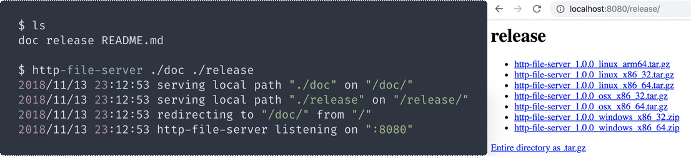

# http-file-server

`http-file-server` is a dependency-free HTTP file server.



## Contents

- [Contents](#contents)
- [Examples](#examples)
- [Get it](#get-it)
    - [Using `go get`](#using-go-get)
    - [Pre-built binary](#pre-built-binary)
- [Use it](#use-it)

## Examples

```sh
$ http-file-server /tmp
2018/11/13 23:00:03 serving local path "/tmp" on "/tmp/"
2018/11/13 23:00:03 redirecting to "/tmp/" from "/"
2018/11/13 23:00:03 http-file-server listening on ":8080"
```

```sh
$ cd /tmp
$ http-file-server
2018/12/13 03:18:00 serving local path "/tmp" on "/tmp/"
2018/12/13 03:18:00 redirecting to "/tmp/" from "/"
2018/12/13 03:18:00 http-file-server listening on ":8080"
```

```sh
$ http-file-server -p 1234 /1=/tmp /2=/var/tmp
2018/11/13 23:01:44 serving local path "/tmp" on "/1/"
2018/11/13 23:01:44 serving local path "/var/tmp" on "/2/"
2018/11/13 23:01:44 redirecting to "/1/" from "/"
2018/11/13 23:01:44 http-file-server listening on ":1234"
```

```sh
$ export PORT=9999
$ http-file-server /abc/def/ghi=/tmp
2018/11/13 23:05:52 serving local path "/tmp" on "/abc/def/ghi/"
2018/11/13 23:05:52 redirecting to "/abc/def/ghi/" from "/"
2018/11/13 23:05:52 http-file-server listening on ":9999"
```

## Get it

### Using `go get`

```sh
go get -u github.com/sgreben/http-file-server
```

### Pre-built binary

Or [download a binary](https://github.com/sgreben/http-file-server/releases/latest) from the releases page, or from the shell:

```sh
# Linux
curl -L https://github.com/sgreben/${APP}/releases/download/${VERSION}/${APP}_${VERSION}_linux_x86_64.tar.gz | tar xz

# OS X
curl -L https://github.com/sgreben/${APP}/releases/download/${VERSION}/${APP}_${VERSION}_osx_x86_64.tar.gz | tar xz

# Windows
curl -LO https://github.com/sgreben/${APP}/releases/download/${VERSION}/${APP}_${VERSION}_windows_x86_64.zip
unzip versions_${VERSION}_windows_x86_64.zip
```

## Use it

```text
http-file-server [OPTIONS] [[ROUTE=]PATH] [[ROUTE=]PATH...]
```

```text
${USAGE}
```
